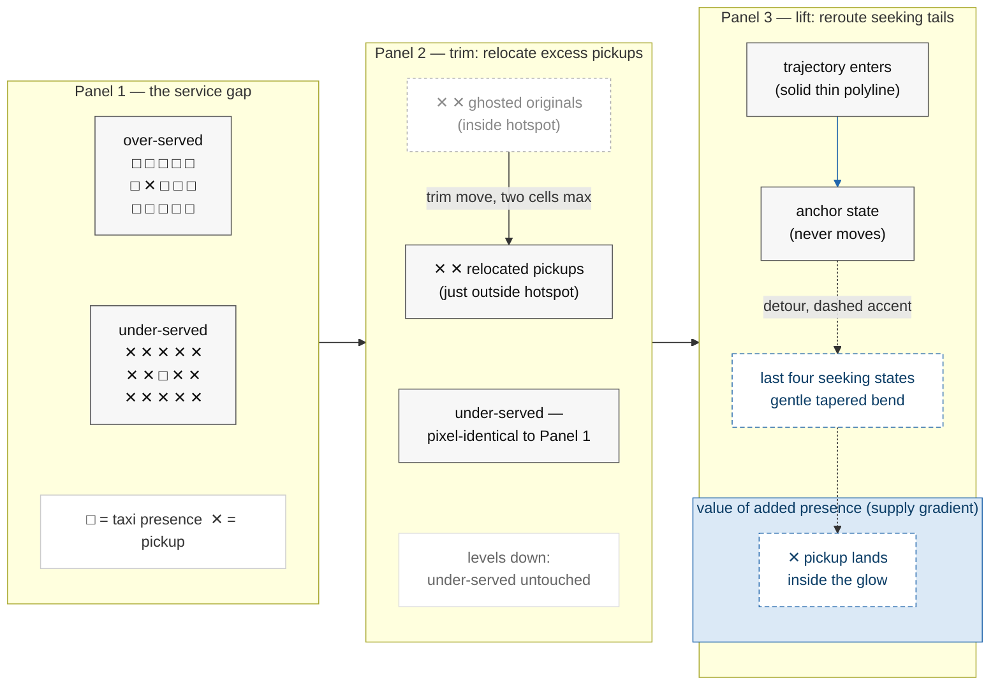
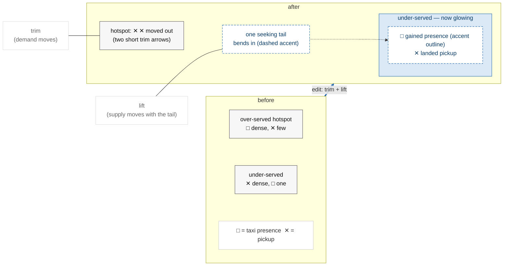
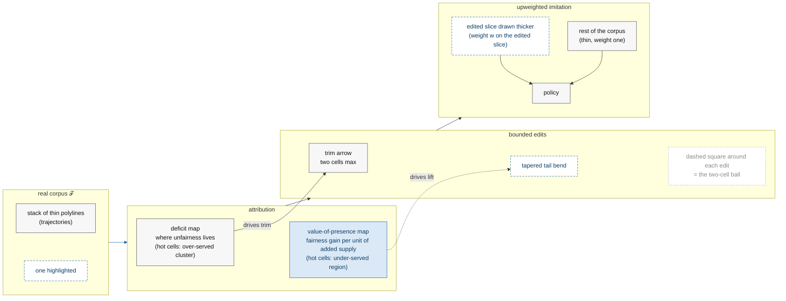
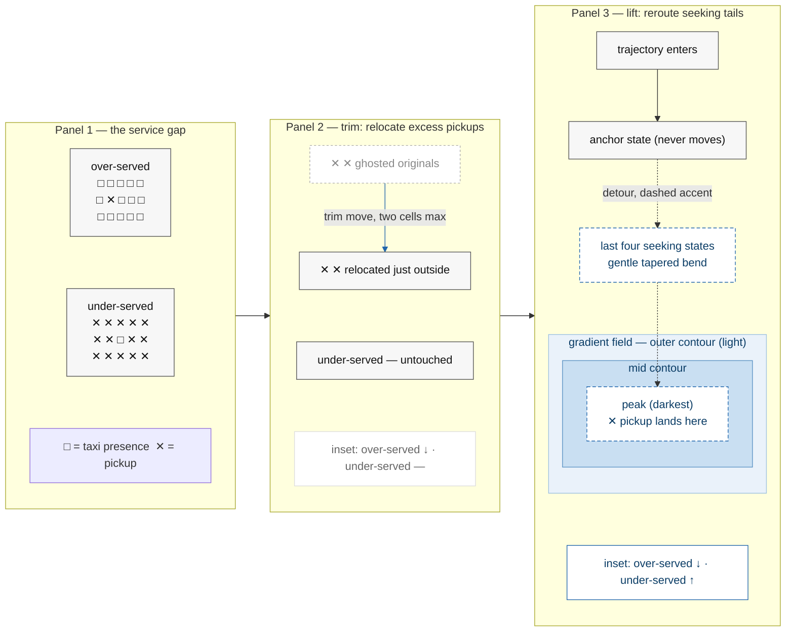

# Figure 1 — Mermaid source for the four variants

Companion to [`figure-1.md`](figure-1.md). One fenced Mermaid block per variant, written for
**import into diagramming tools** (draw.io: Arrange → Insert → Advanced → Mermaid; Excalidraw:
"Mermaid to Excalidraw"; quick preview: mermaid.live), then refined by hand.

**What Mermaid can and cannot carry here.** Mermaid is a graph language: it encodes each
variant's *structure* — panels, regions, edits, flows, containment, styling intent — as boxes
and edges. It cannot draw literal city grids, scatter symbols, smooth heat fields, or curved
tapered polylines. Those are the post-import refinements; each block's `%%` comments say
exactly what to redraw. Symbol conventions ride inside labels (□ = taxi presence, ✕ = pickup)
per `figure-1.md`.

**House constraints carried in the code:** grayscale-safe (accent items are *also* dash-bordered,
so meaning survives mono print); exactly one accent (#2166ac blue) via the `accent`/`accentFill`
classes; no numbers, no "pillar", no tool names in any label.

**Portability notes:** `~~~` is Mermaid's invisible edge (layout ordering only) — if a tool
rejects it, replace with `---` and delete the line after import. All labels are quoted; ` `
is the line break.

---

## Variant A — "Three panels, one city" (safest; mirrors the argument order)

*Post-import checklist:* panel grids identical; the glow is a soft single-hue tint (~12%
opacity) under the under-served region; the tail bend is a smooth curve, not a right angle;
under-served ✕ marks stay dense (starved of squares, not empty).

---

## Variant B — "Before/after split city" (single panel, maximal gestalt)

*Post-import checklist:* the two callouts become tiny labels with leader lines; the gained
□ in the after-city is drawn in accent outline only (fill stays white); this variant shows
no isolated trim failure mode — that is by design (see `figure-1.md`).

---

## Variant C — "Mechanism ribbon" (pipeline; the only variant with the downstream recipe)

*Post-import checklist:* the two attribution boxes become micro heat-maps (tiny grids with a
few dark cells in the right regions); the "drives trim"/"drives lift" cross-edges should
visually bypass the stage arrows (route them below the ribbon); C4E/C4R read best as a
re-drawn trajectory stack with two line weights. The ∂-notation was spelled out in words in
the label to keep it self-explanatory — restore "∂fairness/∂supply" after import if preferred.

---

## Variant D — "A + gradient inset" (recommended production target)

*Post-import checklist:* the nested contour boxes become 2–3 faint iso-lines over a smooth
light→dark single-hue field (intensity = supply-gradient value); the paired insets become
miniature two-bar glyphs in matching corners of Panels 2 and 3 (the pairing IS the message:
Panel 2's "under-served —" is answered by Panel 3's "under-served ↑"); keep both insets
axis-less and number-free. Note the nested-field colors are two tints of the SAME blue —
still one accent hue.
